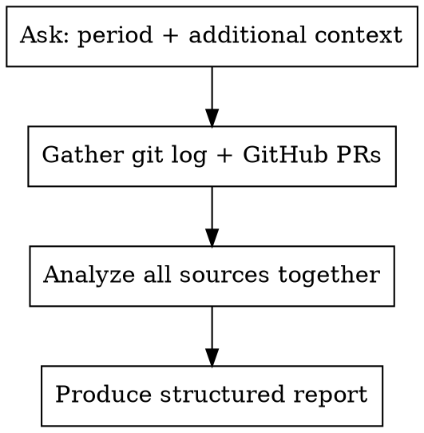

# Recap Team Work

Generate a structured summary of team activity over a specified period by combining automated data sources (git, GitHub PRs) with user-provided context (Slack, meetings, notes).

## Workflow



### Step 1: Ask the User

Use `AskUserQuestion` to collect:

**Question 1 — Time period:**
- Options: "Last 24 hours", "Last 3 days", "Last week", "Other (custom)"
- The user can type a custom range like "Mar 25-28" or "since last Tuesday"

**Question 2 — Additional context:**
- Options: "I'll paste Slack/meeting notes", "Git + GitHub only", "I have Jira tickets to include"
- multiSelect: true — user may want to paste notes AND include Jira

After the user answers, if they chose to paste notes, say:
> "Paste your Slack messages, meeting summaries, or any other context now. Type DONE when finished, or paste everything in one message."

### Step 2: Gather Automated Data

Run these in parallel:

```bash
# Git log with authors (adjust --since/--until to match user's period)
git log --oneline --since="YYYY-MM-DD" --until="YYYY-MM-DD" --all --format="%h %an: %s"

# GitHub PRs updated in period
gh pr list --state all --limit 80 \
  --json number,title,state,author,mergedAt,createdAt \
  --search "updated:>=YYYY-MM-DD" \
  --jq '.[] | "\(.number) | \(.state) | \(.author.login) | \(.title)"'
```

If the user selected Jira, also query relevant tickets if jira-cli is available.

### Step 3: Synthesize Report

Combine all sources into a single structured report. Cross-reference: a PR number in git maps to a GitHub PR, a Jira ticket key in a PR title maps to Slack discussion, etc.

## Report Structure

Use this template — skip sections that have no content:

```markdown
## [Period] Recap: [Project Name]

### Key Initiatives / Big Moves
- Top 2-3 themes or strategic items (infrastructure migrations, major features, architectural decisions)

### By Person
For each active contributor:
#### [Name]
- What they shipped (merged PRs with ticket refs)
- What's in progress (open PRs)
- Notable discussions or decisions

### Notable Decisions & Discussions
- Architectural decisions made or proposed
- Strategic questions raised (with current consensus if any)
- Process changes

### Open PRs Needing Attention
| PR | Author | Title | Status |
|----|--------|-------|--------|

### Items Needing Your Input / Awareness
- Decisions pending
- Questions directed at the user or their area
- Blockers or risks

### New Tickets Created
- Group by type (bugs, features, tasks) if many
```

## Guidelines

- **Cross-reference aggressively.** A Jira ticket mentioned in Slack, a PR, and a commit is ONE item — present it once with all context linked.
- **Highlight what matters.** Don't just list — call out what's important, what's blocked, what needs the user's attention.
- **Skip noise.** Dependabot PRs, release-please housekeeping, and CI-only changes get a one-liner at most, not full sections.
- **Use the user's language.** If Slack uses nicknames or shorthand, mirror that so the user recognizes who/what is being referenced.
- **Absolute dates.** Convert "yesterday" or "2 days ago" to actual dates so the recap stays useful if re-read later.
